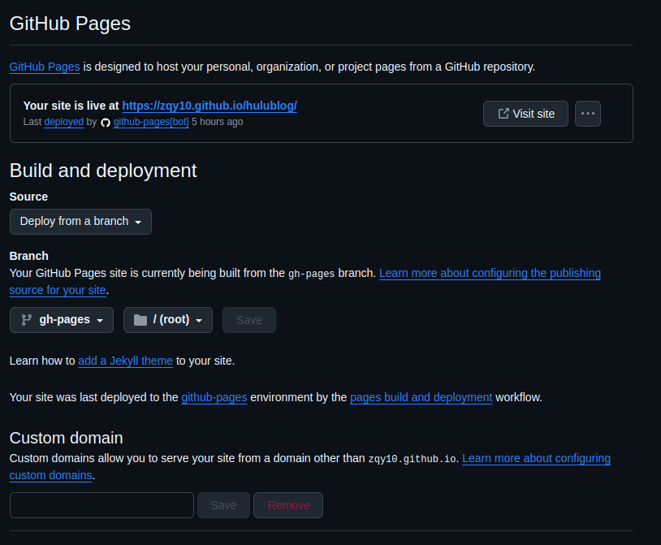

---
date:
  created: 2025-01-18
tags: 
    - Web
comments: true
---
# 个人网站搭建指南

零基础手把手搭建静态网站，适用于个人主页、博客等。  
基于 Mkdocs + GithubPages 。  
---
## 基础知识
这部分了解的可直接跳转[搭建步骤](#搭建步骤)。
### 搭建网站的一般步骤
搭建网站一般分为3大步：  
  
:star: step 1（前期准备）：租用服务器、购买域名、进行备案  
  
<font color='gold'>租用服务器：</font>众所周知，访问网站，相当于和网站对应的服务器进行通信。这个服务器当然可以是你自己的电脑，也可以是云端的服务器资源。但是用自己的电脑有许多的隐患，所以大多人的选择是租用专业的服务器来搭载你的网站。网络上有很多服务器租赁商，包括腾讯、阿里巴巴等任君挑选。  
<font color='gold'>购买域名：</font>每一台上网的服务器都有对应的 ip 地址，但这个 ip 地址通常难以记忆，于是域名便应运而生。域名相当于 ip 地址的别称。举个简单的例子，百度首页的 ip 地址是 119.75.217.109 ，而百度的域名则是 www.baidu.com ，这两者是等价的，但后者显然更便于使用。  
<font color='gold'>进行备案：</font>这一部分不用操心，备案流程一般在租服务器和买域名时会同时进行。
  
:star: step 2（中期搭建）：设计并制作网页  
  
经过 step 1，我们已经有了能够运行的服务器和便于访问的域名。接下来便是设计和制作网页部分。

:star: step 3（后期启动）：上传网页  
  
将制作好的网页上传到服务器中，进行一系列绑定操作，你的网站便可被访问了。

!!!tip "tip"
    <font size=3>上述步骤中租赁服务器和购买域名当然要花好多钱，设计和制作网页也不简单。有没有一种省钱省力的搭建网站方式呢？毕竟我们对网站的要求不用太高。  
      
    当然有！<font color='orange'>接下来为大家隆重介绍 Mkdocs 和 GithubPages!</font></font>

!!!note "<font size=4><strong>先说结论：用GithubPages托管服务，可以一站式解决 step1 和 step3 的问题，而且全程<font color=orange><strong>免费</strong></font>。用Mkdocs制作网站，可以通过markdown文件方便地构建出网页文件，省去繁琐的写html和javascript的过程，方便又轻松，而且全程<font color=orange><strong>免费</strong></font>。</strong></font>"

### Mkdocs
> 摘自[Mkdocs官方文档](https://www.mkdocs.org/): “MkDocs is a fast, simple and downright gorgeous static site generator that's geared towards building project documentation. Documentation source files are written in Markdown, and configured with a single YAML configuration file. Start by reading the introductory tutorial, then check the User Guide for more information.“
  
我们之后的操作中主要使用的是 Mcdocs 的 Material 架构，这也是 Mkdocs 中最常用的架构之一。  
你可以将 Mkdocs 理解为静态网页文件生成器，只要依据一定的架构组织文件，就可以将 Markdown 文件翻译成完整的网页文件。  

参考 [Material for Mkdocs 官方文档](https://squidfunk.github.io/mkdocs-material/) 。  
  
根据步骤进行安装和部署，详细内容在后文搭建步骤中也有说明。

### Github Pages

> 摘自 [GithubPages 官方文档](https://docs.github.com/en/pages/getting-started-with-github-pages/about-github-pages)："GitHub Pages is a static site hosting service that takes HTML, CSS, and JavaScript files straight from a repository on GitHub, optionally runs the files through a build process, and publishes a website. "

GithubPages 相当于一个免费的网页托管服务，可以直接将你存储在 github 上的网页文件发布在后缀为`github.io`的网站上。可以通过访问 `https://[你的用户名].github.io/[你的仓库名]` 来访问你的网站。  
  
GithubPages 的部署和使用也将在后文搭建步骤中详细说明。

### Markdown
使用 Mkdocs 之后，你网页上所发布的文章都将用 Markdown 的格式书写。写 Markdown 整体上与写文本文件没多大差别，但是还是有一些奇淫技巧的（有机会的话我会在我的个人网站上更新这部分内容），可以让内容更加美观。 
   
Markdown 的一些小技巧可以参考：[Markdown扩展语法](2024-09-21.md)  
Mkdocs 也为大家准备了一些：[奇淫技巧](https://squidfunk.github.io/mkdocs-material/reference/)  
为了方便书写和实时查看，建议安装一个 Markdown 编辑器。这里推荐用 [Typora](https://typora.io/)。Typora 用起来相当赏心悦目，但是 Typora 是收费的，不过破解版相信大家自己也能够轻松找到。


---
## 搭建步骤

了解完相关知识，做好一定的准备工作后，我们就可以开始搭建网站了。  
  
开始之前检查，你应该：  
  
- [x] 熟悉 github 操作，[快速入门](https://github.com/rhp62/GitHub)
- [x] 安装好 mkdocs
- [x] 最好有一个 markdown 编辑器 
  
### 组织文件结构
进入 Github，创建一个新的 repository(仓库)，做好正常的基础设置，连接到本地仓库。  
  
 - [ ] 在本地仓库终端执行如下命令

```bash hl_lines="1"
mkdocs new .
``` 
将会创建如下的文件管理结构：  
```text
.
├─ docs/
│  └─ index.md
└─ mkdocs.yml
```
这是最基础的 mkdocs 文件结构，还可以按照如下规范，手动构建文件结构。  
```text hl_lines="9"
.
├── docs
│   ├── about
│   ├── blog
│   │   ├── index.md
│   │   └── posts
│   │       ├── 2025-01-27.md
│   │       └── images
│   ├── index.md
│   ├── javascripts
│   │   └── extra.js
│   ├── overrides
│   ├── SectionA
│   │   ├── 2025-01-28.md
│   │   └── images
│   ├── SectionB
│   │   ├── 2025-01-29.md
│   │   └── images
│   └── stylesheets
│       └── extra.css
└── mkdocs.yml

```
???+tip "解释一下上述文件结构"
    <font size=3>根目录层：
    ```text hl_lines="3"
    .
    ├── docs
    └── mkdocs.yml
    ```
    <strong>docs文件夹用来存放所有网站内容相关的文件；mkdocs.yml是一个mkdocs的配置文件，内容后续会给出。</strong>  
    ---
    docs目录层：
    ```text hl_lines="2"
    .
    ├── index.md
    ├── blog
    ├── SectionA
    ├── SectionB
    ├── overrides
    ├── javascripts
    └── stylesheets
    ```
    进入docs文件夹，index.md 文件是网站的 Home 目录内容；blog 文件夹是存放博客相关内容的（mkdocs专门为博客设计了功能）；stylesheets、javascripts、overrides文件夹都是和自定义网站样式相关的目录，分别存放css、js、和html文件。你还可以<font color="orange">参考blog目录的结构</font>自己创建其他的文件夹（SectionA，SectionB等），存放网站上想展示的其他内容。
    ---
    blog目录层：  
    ```text 
    .
    ├── index.md
    └── posts
        ├── 2025-01-27.md
        ├── 2025-01-28.md
        └── images
    ```
    所有的博客都存放在posts目录下，建议以时间规范命名。
    </font>

### 网站设置
了解了文件组织结构，接下来开始做网站设置。  
  
基础设置：
```yaml
site_name: Your site name
site_url: https://[github-user-name].github.io/[repository-name]
theme:
  name: material
```
当然，基础设置远远不能满足正常需求，我们需要进行高级设置。

高级设置：  
关于高级设置，细节很多，可以参考我的另一片文章[Mkdocs高级设置]()，这里为了不显得太繁琐，不作过多解释，给出了简单的一些高级设置，实现网站的一些基础功能。直接复制粘贴到你的`mkdocs.yml`中即可。
```yaml
site_name: Hulu's Blog
site_description: Not when I came to die, discover that I had not lived
site_author: ZhengQiaoyu

theme:
  name: material
  font: false
  features:
    - navigation.instant
    - navigation.tracking
    - navigation.tabs
    - navigation.path
    - navigation.expand
    - navigation.footer
    - toc.follow
    - navigation.top
    - serach.suggest
    - search.highlight
    - content.tabs.link
    - content.code.annotation
    - content.code.copy
  palette:
    - scheme: slate
      primary: deep purple
      accent: purple

plugins:
  - search
  - blog:
      archive_date_format: MMMM yyyy
  - tags

markdown_extensions:
  - meta
  - toc:
      permalink: true
      toc_depth: 3
  - pymdownx.highlight:
      use_pygments: true
      pygments_lang_class: true
      auto_title: true
      linenums_style: pymdownx-inline
      anchor_linenums: true
      linenums: true
  - pymdownx.inlinehilite
  - pymdownx.snippets
  - admonition
  - pymdownx.arithmatex:
      generic: true
  - pymdownx.betterem:
      smart_enable: all
  - footnotes
  - pymdownx.details
  - pymdownx.superfences
  - pymdownx.mark
  - attr_list
  - pymdownx.emoji:
      emoji_index: !!python/name:material.extensions.emoji.twemoji
      emoji_generator: !!python/name:material.extensions.emoji.to_svg
```

### 配置 Github 工作流


### 写第一篇博客

### 启用 GithubPages 服务
  
进入仓库的 Settings，在左边栏进入 Pages 选项。  


 - [x] 确保 Source 选项是 `Deploy from a branch` 
 - [x] Branch 选项分别是 `gh-pages` 和 `/(root)` 
  
## 网站美化
参考[Mkdocs高级设置]()
---