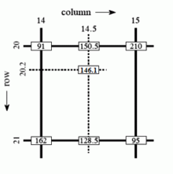

---
date:
  created: 2025-01-21
tags: 
    - 算法
---

# 双线性插值

!!!warning
    <font size=4>:star:题目摘自[2024-zju-hpc-summercamp](https://zjusct.pages.zjusct.io/summer-course-2024/HPC101-Labs-2024)，解答仅供参考。</font>
## 基础知识

### NumPy 

参考NumPy 的[文档](https://numpy.org/doc/stable/)、[Numpy中的乘法](2025-01-22.md)。  


### 双线性插值算法
插值简单来说，就是根据坐标位置，对坐标值进行加权平均。双线性插值，就是在x,y两个方向上各进行一次插值。
<center></center>


#### 形式化定义

> 形式化定义摘自[维基百科](https://en.wikipedia.org/wiki/Bilinear_interpolation)

假如我们想得到未知函数 $f$ 在点 ${\displaystyle P=\left(x,y\right)}$ 的值，假设我们已知函数 $f$ 在 ${\displaystyle Q_{11}=\left(x_{1},y_{1}\right)}$, ${\displaystyle Q_{12}=\left(x_{1},y_{2}\right)}$, ${\displaystyle Q_{21}=\left(x_{2},y_{1}\right)}$ 及 ${Q_{22}=\left(x_{2},y_{2}\right)}$ 四个点的值。


首先在 $x$ 方向进行线性插值，得到

$$
{\displaystyle {\begin{aligned}f(x,y_{1})&\approx {\frac {x_{2}-x}{x_{2}-x_{1}}}f(Q_{11})+{\frac {x-x_{1}}{x_{2}-x_{1}}}f(Q_{21}),\\\\
f(x,y_{2})&\approx {\frac {x_{2}-x}{x_{2}-x_{1}}}f(Q_{12})+{\frac {x-x_{1}}{x_{2}-x_{1}}}f(Q_{22}).\end{aligned}}}
$$

然后在 $y$ 方向进行线性插值，得到

$$
{\displaystyle {\begin{aligned}f(x,y)&\approx &&{\frac {y_{2}-y}{y_{2}-y_{1}}}f(x,y_{1})+{\frac {y-y_{1}}{y_{2}-y_{1}}}f(x,y_{2})\\\\
&=&&{\frac {y_{2}-y}{y_{2}-y_{1}}}\left({\frac {x_{2}-x}{x_{2}-x_{1}}}f(Q_{11})+{\frac {x-x_{1}}{x_{2}-x_{1}}}f(Q_{21})\right)\\\\
&&&+{\frac {y-y_{1}}{y_{2}-y_{1}}}\left({\frac {x_{2}-x}{x_{2}-x_{1}}}f(Q_{12})+{\frac {x-x_{1}}{x_{2}-x_{1}}}f(Q_{22})\right)\\\\
&=&&{\frac {1}{(x_{2}-x_{1})(y_{2}-y_{1})}}{\big (}f(Q_{11})(x_{2}-x)(y_{2}-y)+f(Q_{21})(x-x_{1})(y_{2}-y)\\\\
&&&+f(Q_{12})(x_{2}-x)(y-y_{1})+f(Q_{22})(x-x_{1})(y-y_{1}){\big )}\\\\
&=&&{\frac {1}{(x_{2}-x_{1})(y_{2}-y_{1})}}{\begin{bmatrix}x_{2}-x&x-x_{1}\end{bmatrix}}{\begin{bmatrix}f(Q_{11})&f(Q_{12})\\\\
f(Q_{21})&f(Q_{22})\end{bmatrix}}{\begin{bmatrix}y_{2}-y\\\\ y-y_{1}\end{bmatrix}}.\end{aligned}}}
$$

注意此处如果先在 $y$ 方向插值、再在 $x$ 方向插值，其结果与按照上述顺序双线性插值的结果是一样的。

### NHWC 数据格式

真实情况下我们处理的数据都是以 batch 为单位的，按批进行处理的。以双线性插值为例，我们往往会一次性送入 $N$ 张大小为 $H \times W$ 的图片，每个像素上有 $C$ 个通道，然后一次性返回这 $N$ 张图片处理好的结果。此时我们一次性传入的数据，就是直接按顺序堆叠在一起的 NHWC 格式的数组，它将 batch 作为了第一个维度，而后三个维度分别是单张图片的高度、宽度、通道数。你可以将这一数据格式理解为 c 语言中的高维数组 `image[N][H][W][C]`，而因为 c 的数组和 NumPy 的 `ndarray` 一样都是在内存里连续排放的，所以对于 `image[x1][x2][x3][x4]`，其实就是 `image[x1 * H * W * C + x2 * W * C + x3 * C + x4]` 处的内存。


## 实验任务

<font color='orange'>利用numpy，完成双线性插值的向量化版本，实现加速。</font>  
初始代码详见 [starter_code](resources/code/lab2/starter_code.zip)
!!! info "提示"
    <font size=3>需要将三层循环都替换成向量化实现（尽管加速比可能不是最优的）。</font>
### 基准代码

下面给出直接使用 `for` 循环迭代计算的双线性插值版本：

```python linenums="1" hl_lines="15 16 17"
def bilinear_interp_baseline(a: np.ndarray, b: np.ndarray) -> np.ndarray:
    """
    This is the baseline implementation of bilinear interpolation without vectorization.
    - a is a ND array with shape [N, H1, W1, C], dtype = int64
    - b is a ND array with shape [N, H2, W2, 2], dtype = float64
    - return a ND array with shape [N, H2, W2, C], dtype = int64
    """
    # Get axis size from ndarray shape
    N, H1, W1, C = a.shape
    N1, H2, W2, _ = b.shape
    assert N == N1

    # Do iteration
    res = np.empty((N, H2, W2, C), dtype=int64)
    for n in range(N):
        for i in range(H2):
            for j in range(W2):
                x, y = b[n, i, j]
                x_idx, y_idx = int(np.floor(x)), int(np.floor(y))
                _x, _y = x - x_idx, y - y_idx
                # For simplicity, we assume:
                # - all x are in [0, H1 - 1)
                # - all y are in [0, W1 - 1)
                res[n, i, j] = a[n, x_idx, y_idx] * (1 - _x) * (1 - _y) + \
                               a[n, x_idx + 1, y_idx] * _x * (1 - _y) + \
                               a[n, x_idx, y_idx + 1] * (1 - _x) * _y + \
                               a[n, x_idx + 1, y_idx + 1] * _x * _y
    return res
```
<font color='orange'>实验关键在于numpy多维向量的维度变换。</font>

## 参考方案

### 思路
这其实是图像压缩算法，a是原图像（高H1，宽W1），res是压缩后的图像（高H2，宽W2），b是压缩图像从原图像取样的坐标。  
常见的误区是将b认为是用NHWC数据格式存储的图像，应将<font color='orange'>b理解为索引</font>  
为表方便，我们对每一层循环作如下命名：图像层，纵坐标层，横坐标层，通道层。  

!!!success "note"
    <font size=3>用numpy处理多重循环时，从内层向外层逐步转化更为容易（即从通道层向图像层向量化），否则容易面临维度不匹配的问题。  </font>
这里的内层和外层是根据数据（原图像a）而言的，而非根据一开始写的循环而言的。  
!!!tip "给出本题思路（从内向外，层层深入）： " 
    <font size=3>step 0: 不进行向量化处理的代码容易想见应是一个四重循环  
    step 1: 消除最内层循环，实现通道层向量化 （初始代码已经做到这一步了）  
    step 2: 消除次内层循环，实现横坐标层向量化  
    step 3: 消除次外层循环，实现纵坐标层向量化  
    step 4: 消除最外层循环，实现图像层向量化</font>  

### 代码
下面给出step2~step4的代码。  
  
:star:step 2: 消除次内层循环，实现横坐标层向量化  
`for`循环改造如下：  
```python 
for n in range(N):
    for i in range(H2):
        x = np.resize(np.repeat(b[n,i],C), (W2, C))
        
```


## 参考资料

- 关于双线性插值：[https://en.wikipedia.org/wiki/Bilinear_interpolation](https://en.wikipedia.org/wiki/Bilinear_interpolation)
- NumPy 文档：[https://numpy.org/doc/stable/](https://numpy.org/doc/stable/)
- 一篇不错的入门教程：[https://medium.com/better-programming/numpy-illustrated-the-visual-guide-to-numpy-3b1d4976de1d](https://medium.com/better-programming/numpy-illustrated-the-visual-guide-to-numpy-3b1d4976de1d)
- 一篇稍微硬核一点的教程：[https://www.labri.fr/perso/nrougier/from-python-to-numpy/](https://www.labri.fr/perso/nrougier/from-python-to-numpy/)
- 更多练习：[https://github.com/rougier/numpy-100](https://github.com/rougier/numpy-100)