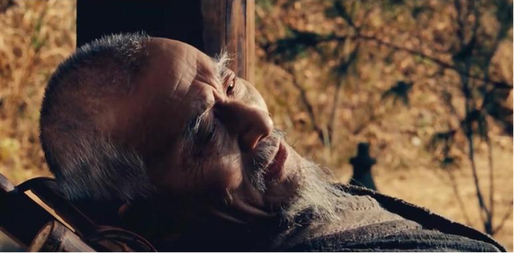

---
date:
  created: 2025-01-14
categories: 
    - 笔记
tags:
    - 电影
---
# 中式江湖的浪漫：武侠电影盘点

!!!note "英雄榜"  
    
    T0：东邪西毒  
    T1：卧虎藏龙、双旗镇刀客、绣春刀  
    T2：剑雨  
    

以下按排名先后介绍。  

------

## 东邪西毒

个人评分：<strong>10.0</strong>  
形：:star::star::star:  
意：:star::star::star::star::star::star:
  

详见另一篇文章：[东邪西毒](2024-10-02.md)

------

## 双旗镇刀客

个人评分：<strong>8.0</strong>  
形：:star::star::star:  
意：:star::star::star::star:  
一句评：西部武侠    

  
导演何平，1991年上映。  
在那个年代，武侠电影几乎被港片统治，大陆很少有优秀武侠。《双旗镇刀客》可以说是大陆武侠中一枝独秀的存在。  
影片有非常浓烈的西部片氛围。故事也都在大漠中展开。情节中规中矩。  
  
故事聚焦于一个少年刀客的成长。影片十分擅长烘托氛围。配乐和画面都有扑面而来的西部氛围感。继承了老一代电影对角色的塑造风格。每个角色都有细心设计，无论是独像还是群像，都能通过几个动作，几句台词将人物形象表现得淋漓尽致。
演技都非常好。  

------

## 绣春刀

个人评分：<strong>8.0</strong>  
形：:star::star::star::star::star:  
意：:star::star::star:  
一句评：螳螂腿，马蜂腰，飞鱼服，绣春刀  

  
路阳导演，2014年上映。
非常用心，非常考究的一部武侠片。  
不同于传统武侠的仙气江湖，《绣春刀》展示的是官府名利场的明争暗斗，情节上中规中矩，胜在题材的新意。完美展现了武侠式锦衣卫的样子。  
  
最为难能可贵的是，全片制作精良，每一处场景，每一件衣服，每一种兵器都有经过仔细考究，高度还原历史，这是以往武侠片所未有的，结果呈现使得影片非常有质感。
独特的题材使得影片更能揭示阶级矛盾和社会困境，更加贴近好莱坞大片的风格也能吸引更多观众。影片打斗非常优秀，总结到一个字就是“帅”！
    
即使是身怀绝技的锦衣卫依然为了钱而低声下气，这有别于传统武侠遗世独立，为国为民的精神风骨，但也使得角色更加真实，剧情更有代入感。  

  

从所谓的艺术角度，《绣春刀》或许不是那么优秀，但整体的质感，精细度可以算是最佳。武侠电影IP化和工业化的优秀实践。可以说《绣春刀》是把武侠电影“形”的方面做到了极致。    
选角也非常好，张震的一句“在下北镇抚司，沈炼”，让我感觉他就是沈炼，沈炼就是他。包括加钱哥，都是让人津津乐道的。  
  

可惜的是《绣春刀2》算不上成功，唯一的亮点也就是辛芷蕾了。

------

## 剑雨

个人评分：<strong>7.0</strong>  
形：:star::star:  
意：:star::star::star::star:  
一句评：女子的江湖  

苏照彬导演，2010年上映。  
票房不好，但近年来越来越多人说其当时被严重低估，是近十年武侠电影巅峰，我不认为它有这么优秀。    
当然《剑雨》是一个不错的武侠电影，在同风格武侠中十分出色。    
  
《剑雨》的主要槽点在剧情上。虽然我不至于对武侠电影的剧情和逻辑吹毛求疵，但《剑雨》的剧情实在是不合我胃口。整体上电影专注于江湖间传统的恩怨情仇，显得剧情非常老套，加上“争夺摩罗遗体”的动机，影片给人一种比较虚浮
的感觉。所有的剧情围绕这一动机展开，夺得摩罗遗体便能炼得无上功法称霸武林，就像《信条》里集齐几个方块就能毁灭世界的矛盾中心一样，有点太敷衍，太脱离实际了。武侠要有浪漫想象，但不能太中二。  
  
上一次见到这种动机还是在金庸的《倚天屠龙记》之中，得倚天剑屠龙刀者无敌于天下，但是后来金庸很好地圆回来了，两件神兵中藏有《九阴真经》，这在逻辑上可以更立得住脚。《剑雨》是以另一种方式来圆，黑石的头目是太监，
所有人热热闹闹地忙活几年只是为了他恢复男人身，很荒诞，但也和前面的动机勉强对应上了，只是格局小太多。  
  
除去剧情的槽点，电影的风格也是比较杂乱。在江湖恩怨，爱恨情愁间穿插喜剧元素，可以是点睛之笔（如笑傲江湖），但处理不好就会显得有些突兀，《剑雨》便是后者。  
  
比起剧情，《剑雨》其实更重意境。但意境也没表现地让人眼前一亮。《剑雨》的江湖是平淡的生活，武功盖世又如何，终归向往的还是那一座小屋，一个爱人。 
《剑雨》的打斗还算不错，细节挺多，江阿生扮猪吃老虎的桥段让人印象深刻，大S演的蛇蝎美人也很漂亮。
  

不过影片也有惊喜。游本昌饰演的僧人有一句非常厉害的台词。  
  

“我愿化身石桥，受五百年风吹，五百年雨打，五百年日晒，只为她能从这桥上经过。”这是佛陀弟子阿难的故事，非常美好的爱情宣言。  
为这一段台词，我可以给《剑雨》加几分。
